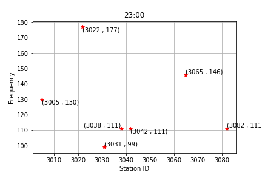

# Capital One Project
## Interesting Trends in the Data
 
### Change in Trip Durations as Months Change

##### As the months get colder, the average trip durations get longer. This is because the colder months in L.A. are much more comfortable to exercise in the warmer ones.
 
### Change in Pass Types Over as Months Change

##### It is immediately clear that a very low percentage of the monthly riders are staff members. The graph also reveals that the percentage of people using flex passes remains fairly constant, and small, as the months change. The interesting data comes from the walk-up vs. monthly pass data. Monthly passes are more popular than walk-ups in every single month, but the difference is exagerated in the month of July. This is most likely because many students in L.A. are on vacation for that month and are therefore more likely to ride bikes around the city. This makes it cheaper for them to buy a monthly pass than pay extra every time they take out a bike.

### Change in Number of Riders as Months Change

##### *The month of July is left off of the graph because there was not enough data to compare the monthly ridership to other months.* 
##### The graph shows a steady decrease in monthly ridership over the period of time from August to December, then it begins to increase again in March. This is directly correlated with the change in temperature in Los Angeles. Although it is still fairly temperate relative to other states in the Winter, the city's denizens are much less likely to ride a bike outside because it is cold for them.

## Most Popular Stations IDs
### For Starting
1. 3069 with 5138 trips starting from there.
2. 3030 with 5059 trips starting from there.
3. 3005 with 4883 trips starting from there.
4. 3064 with 4661 trips starting from there.
5. 3031 with 4629 trips starting from there.
6. 3014 with 4571 trips starting from there.
7. 3042 with 4015 trips starting from there.
8. 3082 with 3908 trips starting from there.
9. 3022 with 3893 trips starting from there.
10. 3067 with 3797 trips starting from there.
### For Ending
1. 3005 with 6262 trips ending there.
2. 3031 with 5517 trips ending there.
3. 3014 with 5385 trips ending there.
4. 3042 with 5293 trips ending there.
5. 3069 with 5072 trips ending there.
6. 3082 with 4703 trips ending there.
7. 3064 with 4605 trips ending there.
8. 3022 with 4337 trips ending there.
9. 3030 with 4224 trips ending there.
10. 3063 with 3763 trips ending there.

## Average Trip Distance
#### 1.737 kilometers

## Number of Riders that Include Bike Sharing as a Regular Part of Their Commute
#### 90821 riders
##### *Calculated based on the number of riders who used the service with a monthly or flex pass.*

## Change in Ridership with Seasons
### Change in Average Trip Duration

##### There is a clear upward trend in the length of the average trip as the seasons change from summer to fall and from fall to winter. This trend can be attributed to the fact that the citizens of L.A. are much more willing to bike for longer periods of time when it is colder than when it is very hot and humid, like it is in the summer. 
### Change in Usual Route Type

##### The only attribute of the data revealed by this graph is the fact that riders do not change their tendencies with the seasons when it comes to the type of bike trip they embark on, with one way trips being significantly more popular all of the time.
### Change in Usual Pass Type

##### As with the previous graph, it is clear that the bike sharers of Los Angeles do not change their pass preference as the seasons change. Monthly passes are more popular than walk-ups over all three seasons and walk-ups are more popular than flex passes over all three seasons as well. 

## Trends Over the Course of an Average Day
### Average Number of Riders

##### As would be expected, the quantity of bike sharers is at a minimum around 3-5 am and it generally increases throughout the day. That being said, there are clear spikes in ridership at 8 am, 12 pm, and 5 pm. The spikes can be easily explained by thinking about an average worker/student's day. They must commute to work or school around 8 am, go somewhere to get lunch around 12 or 1 pm, and then commute home around 5 pm. These are the times when the bike sharing companies must ensure a sufficient number of bikes be present at the most popular spots.
#### *Shown below are the IDs of the most commonly used bike stations over each hour of the day.*
#### *The trends can be used to tell the bike sharing company where most of the bikes should be at all times*

###### ^^^ Significantly more bikes at the top station, ensure bikes are there.

###### ^^^ Significantly more bikes at the top station, ensure bikes are there.

###### ^^^ Significantly more bikes at the top station, ensure bikes are there.

###### ^^^ Significantly more bikes at the top station, ensure bikes are there.

###### ^^^ Significantly more bikes at the top station, ensure bikes are there.

###### ^^^ Significantly more bikes at the top station, ensure bikes are there.

###### ^^^ Significantly more bikes at the top station, ensure bikes are there.

###### ^^^ Significantly more bikes at the top station, ensure bikes are there.

###### ^^^ Significantly more bikes at the top station, ensure bikes are there.

###### ^^^ Significantly more bikes at the top station, ensure bikes are there.

## Breakdown of Trip Route Category-Passholder Type Combinations
### Monthly Passholders
- 95.36% embark on Round Trips.
- 4.64% embark on One Way Trips.
### Flex Passholders
- 94.92% embark on Round Trips.
- 5.08% embark on One Way Trips.
### Walk-ups
- 79.51% embark on Round Trips.
- 20.49% embark on One Way Trips.
### Staff
- 78.27% embark on Round Trips.
- 21.73% embark on One Way Trips.

